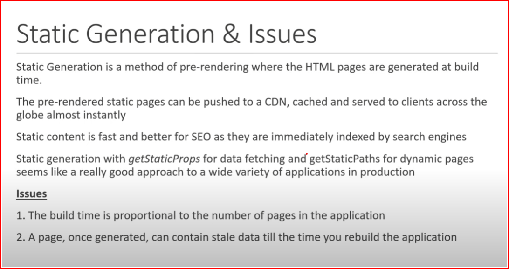
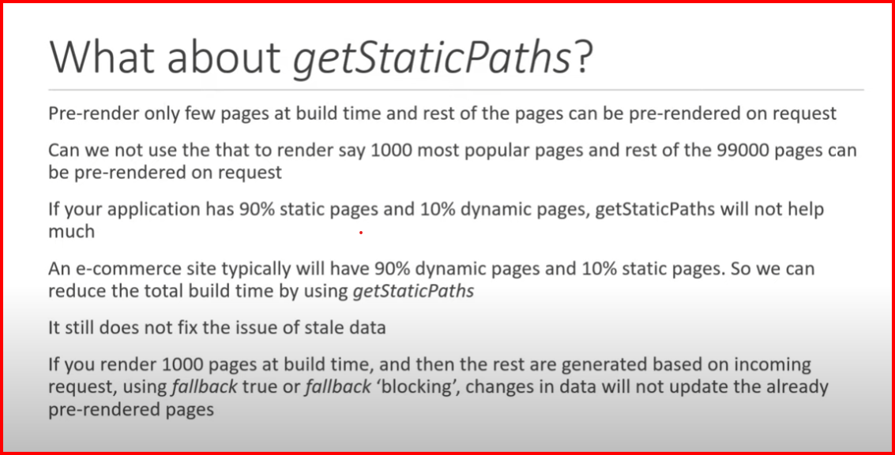
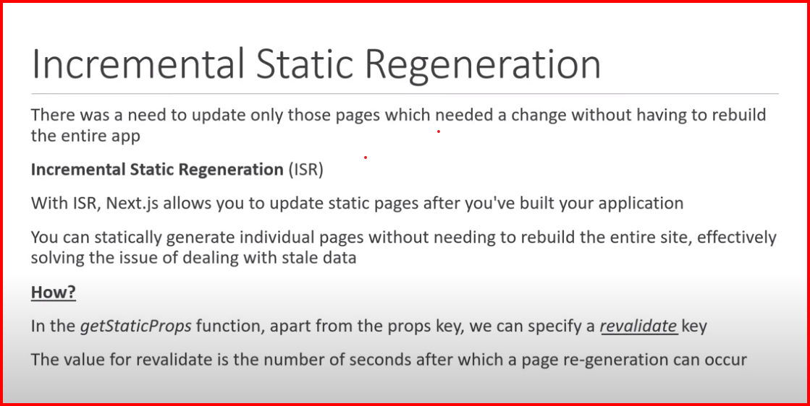
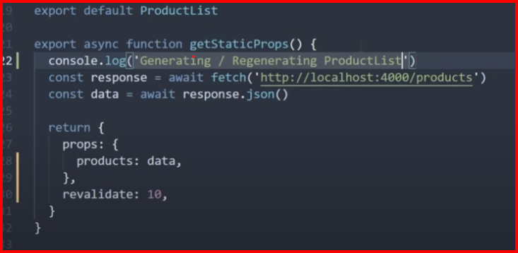
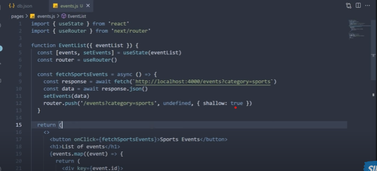
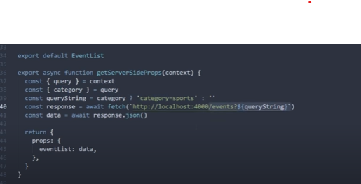
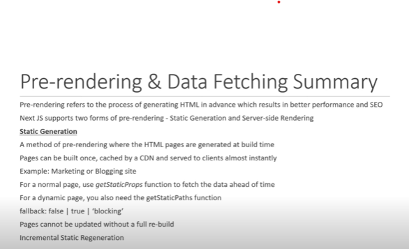
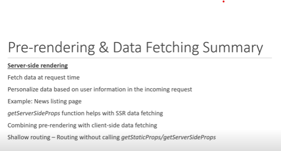

# NextJS

- NextJS is a framework that built on top of react for building fullstack web applications.
- Generally react is library for building User Interfaces we need to develop features like routing, auth, styling, etc.
- In other hand NextJs is a packages uses react for building user Interfaces were it had more inbuilt features like routing, auth, bundle optimization, styling, etc. no need of custom packages.
- # In Simple NextJS is the react framework for production ready applications
- why NextJs
  - Next simplifies the process od building a react applications for production
    1. File Based routing : when building a react app we need to use a custom packages for creating routing in other hand next provides file based routing to simplify
    2. Pre-rendering : Next generates HTML for each page in advance instead of having it all done by client-side JS
    3. API routes : we can also create api's with NextJS that why is called a fullstack framework
    4. Supports CSS Modules
    5. Authentication
    6. Dev and Prod Build system

# How to install Next and Setup

- To create next app
  - # npx create-next-app <ProjectName>
- To run
  - # npm run dev / yarn dev
- Project Folder Structure
  - package.json is for dependencies and metadata of the project structure were as react and react dom is building for UI next is framework and eslint for linting the error and warnings
  - scripts
    - dev is to run on development environment
    - build is for prod deployment
    - start is for start the complied app in production mode
    - lint is for checking
  - next.config.js file is a nextJS Configuration file
  - .eslintrc for configuring linting
  - .next Folder it is generated when we run either dev or build script this is the folder our application is served from
  - styles folder we can define the style files and modules too.
  - public folder holds all the public resources for our application
  - pages folder is responsible for entire routing feature in our application
    - \_app.js we will define the application layout
    - api folder for creating api's for our app
  - when we run the npm run dev the execution run through the \_app.js which contains the MyApp Component automatically receives the component and pageProps which will return as JSX

# Routing

- # Routing setup in next with Pages
  - Routes with pages
  - Nested routes
  - Dynamic routes
  - Catch all routes
  - Navigate from the UI
  - Programmatically navigate b/w pages
- # Routing with pages
  - when ever we create a file in pages folder it will be considered as a routes [index.js will be considered as default route ]
- # Nested Routing
  - we can create the nested routes using folders in pages create a new folder inside that create a base index file and create child route files
- # Dynamic Routing
  - we can create a folder in pages inside that need to create a base index.js file and another file for dynamic routing with array brackets.js
  - eg: [productId].js
  - to get the productId in the [productId].js file we need to use hook from next called useRouter
  - const router= useRouter()
  - from this router object we can access the query parameters like `router.query.productId`
- # Nested Dynamic Routing
  - we can create a dynamic folder in pages inside that we can create nested dynamic routes
  - for eg this `products/1/review/1`
  - for this first we will create a dynamic folder [productId].js inside that we will create a base index.js file for displaying productId details inside the [productId].js folder we will create a folder called review inside that we will create [reviewId].js for reviewId details.
- # Catch All routes
  - generally we use this if we have many routes like eg 20-40 routes
  - basically it will catches all the url's after the base route and it maps it into single file.
  - we will create folder in pages inside that we will create a special syntax file like [...params].js
  - not that much used, we can get the route params using useRouter with router.params.
- # Link Component Navigation ( Navigate from the UI )
  - Navigating from one page to another in UI we have component called Link that will be importing from next
  - <Link href='/blog'>Blog</Link>
  - we have a replace prop in link tag if we use that it will replace the current history and navigates to home.
- # Programmatically navigating.
  - In next we have useRouter and we use the router.push() to navigate to another screen. it we don't want the router history we can use router.replace() to navigate.
- # Custom 404 Page
  - if the route was not present in our app that by default it will show the 404 page we can modify it if we want
  - need to create a 404.js in pages and we style it

# Pre-rendering & Data Fetching...

    - what is pre-rendering and what is the use of it
    - type 1 - static generation [with and without data & Incremental static generation & dynamic parameters when fetching data]
    - type 2 - server-side rendering [ data fetching]
    - client-side data fetching
    - combining pre-rendering with client-side data

- # Pre-rendering
  - As we know that the react app will not render every page in the application
  - By default the next app will pre-renders every page in the application
  - Pre-render means, nextJs generates the HTML for each page in advance instead of having it all done by client-side javascript
  - In a react app once the JS is loaded for the page it will execute in the browser create diff dom nodes and mount them on the root div this process also called as hydration.
  - In the next app the HTML is already generated with the req data and sent to browser then the JS will load the page
  - pre-render means render in advance of sending it to the browser
  - Why pre-render is required
    - it improves the performance
    - In the react app we need to wait for the JS to be executed
    - it helps with SEO
- # Static Generation
  - It is a pre-rendering method were the HTML pages are generated at build time.
  - Eg to use Blog pages, e-commerce product pages, documentations and marketing pages.
- # Static generation with data
  - generating the html after fetching some external data
  - we can define an async function named as `getStaticProps` or `getServerSideProps` and export it at the build time in production it will fetch some data and pass down as page props and the async function will return an object as props with key value pairs
    -Eg: return{
    props:{
    users: response.data;
    }
    }

# getStaticProps

    - it runs only on server side
    - the function will never run on client side
    - this will be bundled in UI side
    - we can write the server side code directly in the function like accessing the FS module, db, etc.
    - it is allowed in pages only and it is used for pre-rendering and not for client side data fetching
    - it should return a object and inside that it should contains the props object with the data
    - it will run at build time only

# Pages vs Components

- we can create Components in next by creating a Components folder in project directory.

# Builds

- how our app is bundled and prepared for production deployment
- to build our app we to run npm run build / yarn build
- it will create an optimized production build of our app
- the build will generate the .next folder that contains is used to serve the browser
- to preview our build need to run npm run start/ yarn start

# master/ list details pattern in UI

- where we will have a list of items and each ite will have detailed page
- how to generate the static pages with the dynamic Id's
- in the list's page fetch the data in `getStaticProps` and pass it through props this will pre-render the lists
- the detailed page were will fetch details of each id we will make an api call in `getStaticProps` but to access the dynamic Id there will be default parameter in `getStaticProps` we can call it as context in that object we will destructure `params` from that we will use that in api as `params.postId` and we will return the props object that will receive in component props.
- but here the we need to use the `getStaticPaths`
- # getStaticPaths :
- it was used to inform the nextJs that these are the possible values that postId.js page should be statically generated for.
  - it we are generating the static pages dynamically we need to use the getStaticPaths, means it's an async function that returns a object that contains the path key this key determines which paths are statically generated at build time the key is an array of objects
  - return {
  - paths:[
  - {
  - params:{postId:'1'}
  - }
  - ],
  - fallback:false
  - }...etc
- # Fetching paths from getStaticPaths
  - if we are having n.no of posts were to generate it by statically
  - fetching paths dynamically in `getStaticPaths` we do it by fetching data and map it
    async function getStaticPaths(){

const paths= data.map((post)=>{
return {
params:{
postId:`${post.id}`
}
}
})
return {
paths,
fallback:false
}
}

- # fallback key in getStaticPaths
- the fallback accepts the values they are true/ false/ blocking
- # fallback set to false
- when the fallback is set to false
  - the paths returned from the getStaticPaths will be rendered to HTML at build time by getStaticProps
  - if fallback is set to false then any paths not returned by getStaticPaths will result 404 error page. [`it we try to access the undeclared path in getStaticPaths that will render the 404 page. means we will define the dynamic paths in that async function.`]
  - `Generally it is most suitable for if we are having small number of paths in our app. like blog,`
- # fallback set to true [`complex on`]
  - when the fallback is set to true.
  - the paths returned from the getStaticPaths will be rendered to HTML at build time by getStaticProps
  - The path that have not been generated at build time will not result in 404 page. Instead NextJS will serve a fallback version of the page on the first request to such path
  - In the background NextJS will statically generate the requested path HTML and JSON. This includes running getStaticProps.
  - When that's done the browser receives the JSON for the generated path. this will be used to automatically render the page with the required props. from the use perspective the page will be swapped from fallback page tp the full page.
  - At the same time the NextJS keeps track of the new list of pre-rendered pages in future to request the same path will serve the generated pages just like other pages pre-rendered at the build time.
- # fallback is set to blocking
  - fallback blocking is similar to fallback true
  - 
  - 
- # Incremental Static Generation
- we can revalidate for every 10 secods if we are having any changes that will update for every 10seconds
  - 
  - 

# Two form of pre-rendering

- Static Generation
- server side rendering
- # Static Generation
  - the HTML is statically generated at build time the built page is then cached and reused for each request
  - for a dynamic page with getStaticPaths and fallback set to true the page is not generated at build time is generated on the initial request
  - with the incremental static generation a page can be re-generated for a request after the revalidation time has elapsed.
  - Problems with Static Generation
    - we cannot fetch data at req time
    - let's day for a new paper website for every seconds the news will be updated here the static generation will not help here it's hard to go with the ISR.
- we don't get access to the incoming request.
- # Server Side Rendering

  - NextJS allows to pre-render a page at request time not at build time.
  - So the HTML is generated for every incoming request.
  - How NextJS will make it possible to fetch data at request time and how it will get the accessing of incoming request time

# How to fetch the data to pre-render using Serve Side render

- In nextJS if we want to use SSR we need to export an async function called `getServerSideProps`, it will called by server for every request inside that we can fetch data and serve as props to the component.
- In that function we will return a object that contains props object and that will be served to our page component.
  - Imp points
    - `getServerSideProps` will run only server side
    - this function will never run on client side
    - the code return inside this function that will not include in JS bundle that is sent to Browser.
    - we ca write the ser-side code in this function like accessing fs module or querying a DB can done
    - this functions will work on only in pages not on components
    - it will on every request time
- # SSR with Dynamic Parameters
  - we will create a dynamic file and in that we will export our component and async function
  - In the async function will make an api call with the dynamic parameters, To get the dynamic parameter in the Server side props we will receive a context as function
    parameter from that we can destructure and take the params as we have done same for the Static Generation for `getStaticProps`, `const {params} = context`, `const {ID} = params`, after making api call we should return the object that contains the props object that contains our data and that can be passed to out page as props.
  - we can also include the req, res from the context parameter.
  # Client Side data-fetching
  - will use useEffect();
  - # SWR for Data Fetching...[React hooks for data fetching...] in NextJS
    It was the best one for fetching data
  - # Pre-rendering + Client side data fetching..
  - As usual we can define the async function and export it ant return the object contains the object `getServerSideProps` in tis will make an api call.
  - # Shallow routing... routing without calling getStaticProps/getServeSideProps.
  - 
    
    `refer to video---------------------38`
  - Summary
  - 
  - 

# API Routes Section.....

  - What is API route features & how to create a basic API in NextJS
  - Handle GET & POST requests
  - Dynamic API routes
  - Handle DELETE request
  - Catch all API routes.
